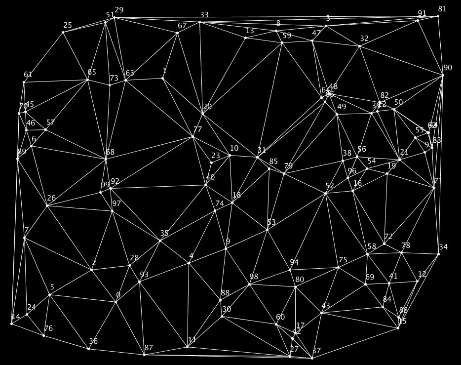

# Delaunay-triangulation

Implementing an O(n*logn) algorithm for calculating the Delaunay triangulation of a set of points.
The program find one new triangle each frame, so the algorithm can also be tracked with the eye.

Example result:

